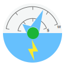
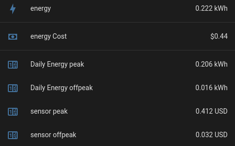

# Energy Meter

[![GitHub Release][releases-shield]][releases]
[![License][license-shield]](LICENSE)
[](https://github.com/hacs/integration)



The Energy Meter integration provides functionality to track consumptions of
various utilities, like the builtin Utility Meter. But on top of it, it adds
entities to track costs for each tariffs.

Provides extended features on top of the builtin utility meter and energy
sensors to track costs for each tariff as well as total costs. It is possible
to achieve the same using templates, but it is long and error-prone to do it
for every single energy entity you want to track



## Installation

### HACS - preferred

This repository is compatible with HACS. This is the preferred way to install
the custom component.

### Manual

1. Download the release zip from [releases pages][releases]
2. Copy it within `<HA config dir>/custom_components/energy_meter`
3. Unzip in place
4. Restart Home Assistant

## Configuration

The configuration of the component is mostly the same as the builtin
`utility_meter` integration:
https://www.home-assistant.io/integrations/utility_meter/

The only difference is the addition of `price` and `price_entity` options:

---

**price** _float (optional)_

The static price of the tariff (in currency/kWh)

---

**price_entity** _string (optional)_

The entity ID of a sensor giving the current price of the tariff (in
currency/kWh)

---

The price must be given in currency/kWh. It depends on your currency
configuration. For instance, if your configured currency is dollar, it must be
in $/kWh.

Only one of `price` or `price_entity` should be given. If both are given,
`price_entity` would have precedence. If none is defined, this integration will
act as a basic utility meter, with no cost tracking.

## Example

```yaml
energy_meter:
  daily_energy:
    source: sensor.energy
    name: Daily Energy
    cycle: daily
    price_entity: sensor.current_energy_price
    tariffs:
      - peak
      - offpeak
  monthly_energy:
    source: sensor.energy
    name: Monthly Energy
    cycle: monthly
    price: 0.20
    tariffs:
      - peak
      - offpeak
```

[releases-shield]:
  https://img.shields.io/github/release/zeronounours/HA-custom-component-energy-meter.svg?style=for-the-badge
[releases]:
  https://github.com/zeronounours/HA-custom-component-energy-meter/releases
[license-shield]:
  https://img.shields.io/github/license/zeronounours/HA-custom-component-energy-meter.svg?style=for-the-badge
